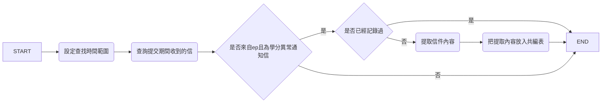

# mail 內容擷取

## 功能

1. 可正確擷取特定寄件者於特定時間段的信件內容
1. 學校代碼皆可以6碼方式呈現
1. 日期格式yyyy-MM-dd HH:mm:ss呈現
1. 「學期成績FID：」後沒有資料時，將該欄位保留空白
1. 可濾掉「重修重讀名冊fid/進修部成績名冊fid」重複的資料
1. 可以排除000000的測試資料

## 整體流程

```mermaid
flowchart LR
A[START]-->B1(設定查找時間範圍)-->B2(查詢提交期間收到的信)-->C{是否來自ep且為學分異常通知信}
C-->|是|D1{是否已經記錄過}
D1-->|是|Z[END]
D1-->|否|D11(提取信件內容)-->D12(把提取內容放入共編表)-->Z[END]
C-->|否|Z[END]
```
